# Financial Distress Prediction Report

Rui Shen

shen.ru@husky.neu.edu

CSYE 7245, INFO 7390, Spring 2018, Northeastern University

###Abstract

While investing a company - no matter capital venture, loan, or acquisition, the financial health of that company is one of the most important considerations to the most. Therefore, it's crutial for financial companies to have an accurate evaluation of the financial distress index. It is considerably difficult to perdict the future trend of a company for several years, but much easier to identify the current situation. Gathering public data and calcluate a financial distress index before further dicsion is an effective way to prevent loss.

### Introduction

kaggle.com has a lot of datasets regarding "predict financial distress", one of them contains as much as 83 independent variables. This project will use the dataset to predict whether a company is financially healthy or not when given a particular combination of 83 varaibles. In the project, I am going to use four machine learning algorithms: multiple linear regression, support vector regression, random forest regression and neural network. I wil use GridSearchCV to auto identify the best R-squared value for tune each the model, and compare the accuracy rate based on R-square value.

### Understanding dataset

- Understanding how dependent and independent variables distributed is important. One of the difficulties with this dataset is it's not properly labelled, independent variables are named as x1-x83, which causes troubles to identify inappropriate values, also make it hard to remove outliers.

  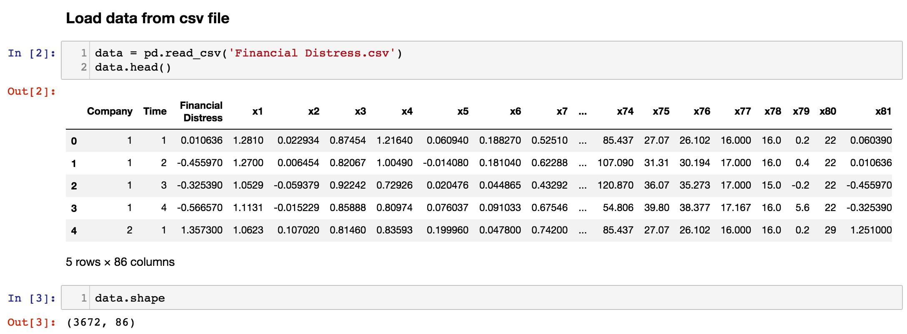

- It's also easy to see that no missing value exist in the dataset.

  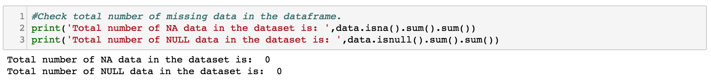

  An obvious trap of this dataset is the highly imbalance of the output.

  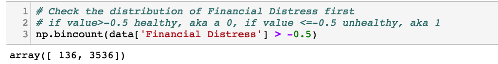

  ​

- Now we will take a look at each column by plotting boxplot, distance plot and trend plot. It is difficult to show and compare all 83 columns once, so a nice way would be to divide them into four batches. The code below only shows one batch.

  1.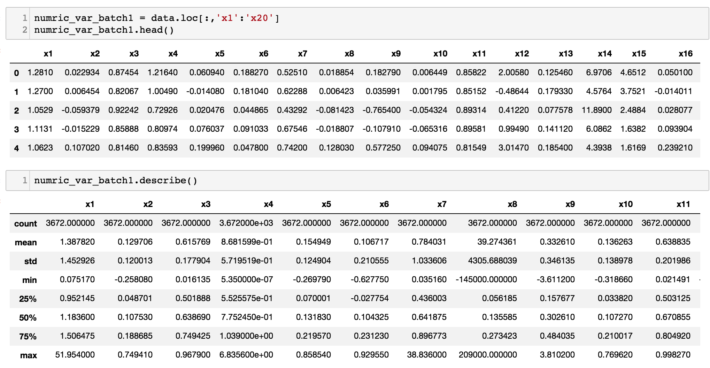

  2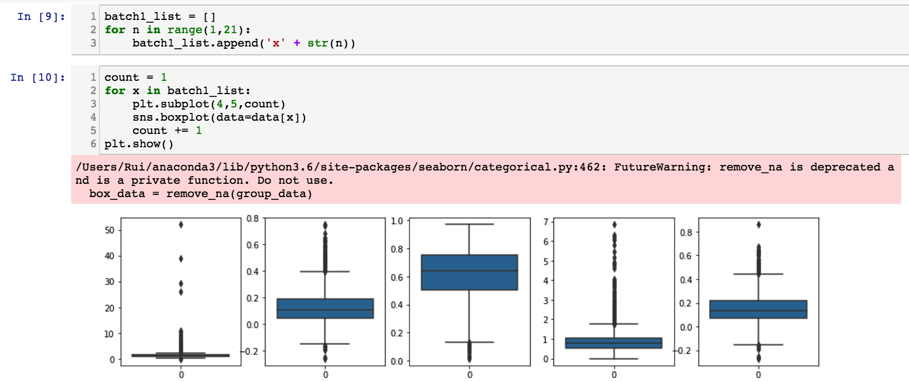

  3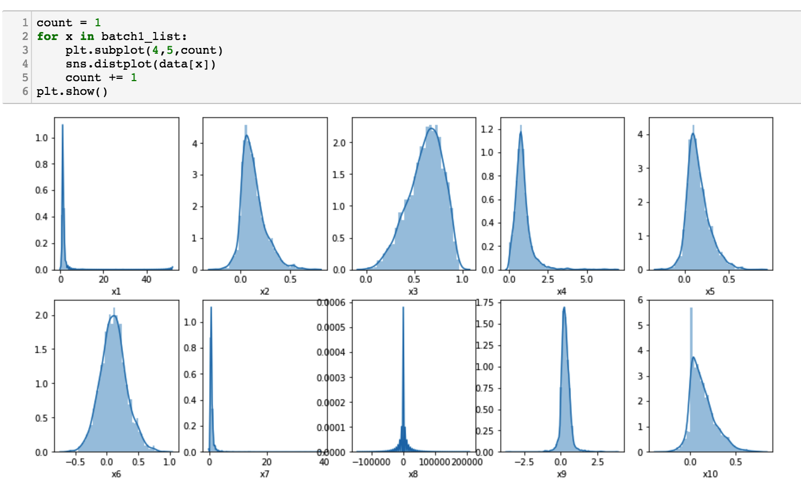

  4. 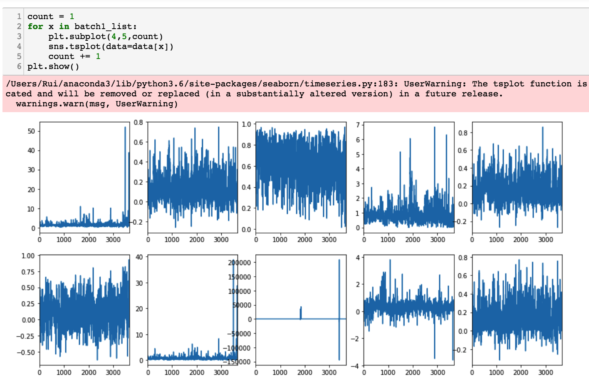

  ​

- I also tried to detect outliers, however due to unhighly imbalance and lack of proper tagging of the variables, it is hard to remove any of them.

  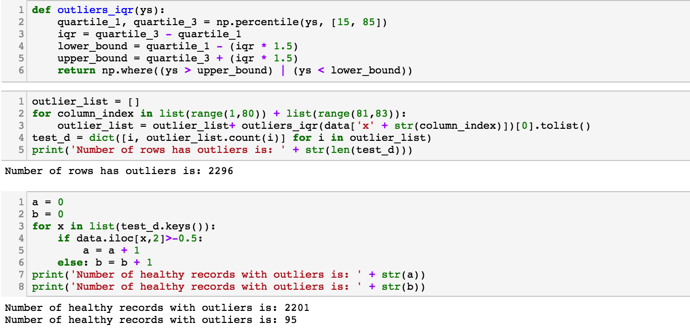

- Another necessary step for understanding dataset is to look at thier correlation, since in previous plots we can see that many vairables seems to have similar curves and range. I drew a correlation matrix using the corr() function and also plot a heatmap using sns. I'll drop these columns later using variance inflation factor(vif).

  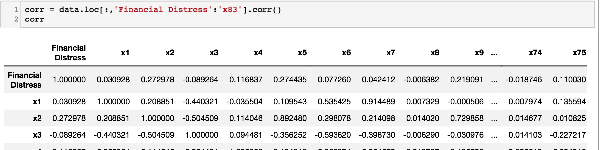

  ​

  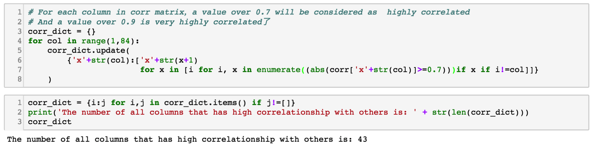

  ​

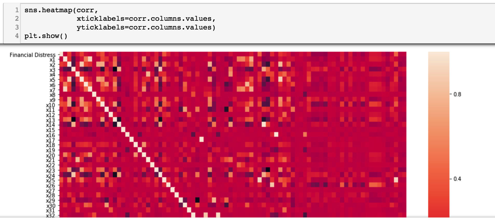

- Now since there is one categorical column x80 in the dataset, we need to perform one hot coding first.

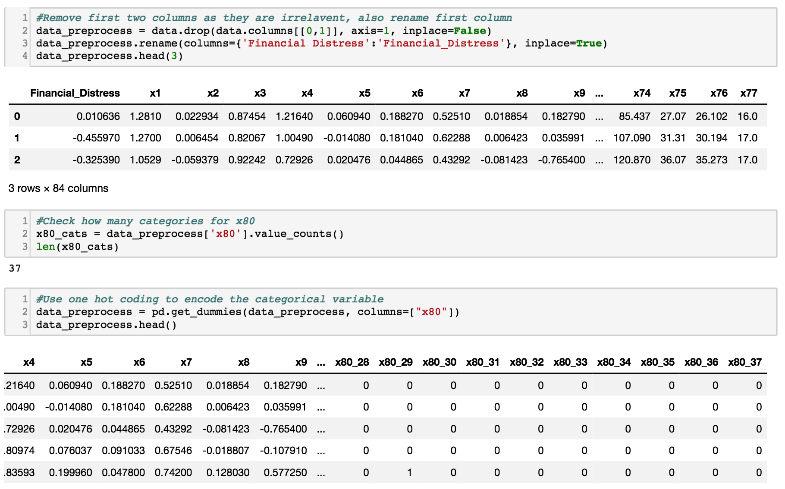

- Then normalize the dataset by following code.

  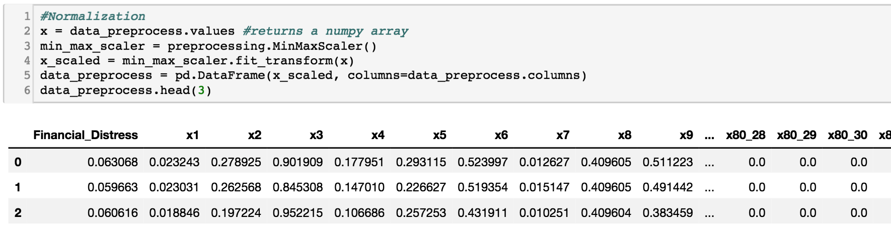

- Reducing dimension was done by two algorithms, one by removing columns with high correlation value using vif, one by checking p-value of the linear analysis result. Once both processes were done, there were only 25 independent variables left.

  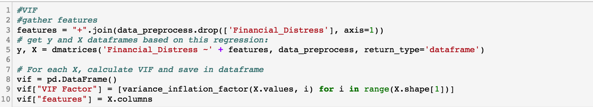

  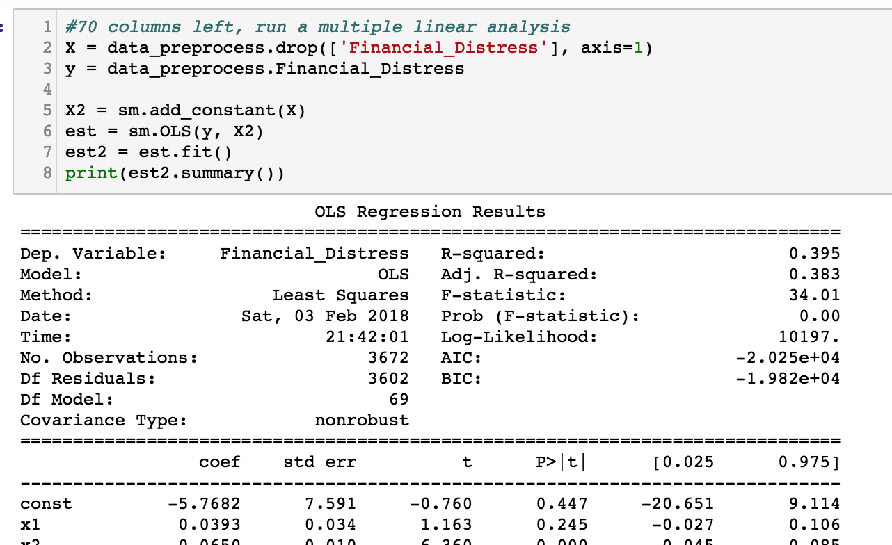

###Run machine learning algorithms

#####Split dataset and define cost methods

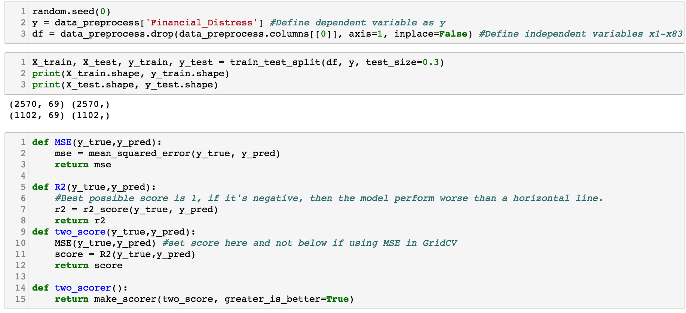

##### Multiple linear regression

Multiple linear regression is straight-forward with no parameters to adjust. I am running this model because in machine learning, sometimes a complex question can be solved by a seemly easy model. However, even though the MSE score is low in this case, the negative R-square score indicates a poor model

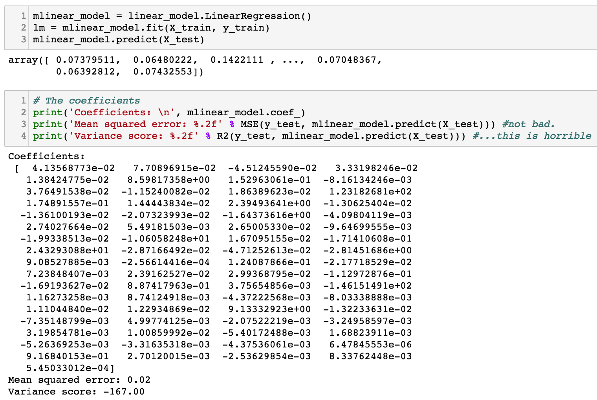

#####Support vector regression

For SVR, I tried two different kernels: rbf and linear, and it turns out the rbf always performs better. However, since all changes were done in the same cell, no records were left for these efforts. The last set of parameters are listed here, the best paramter chose by GridSearchCV can reach a MSE with nearly 0, and a R2 to 0.54.

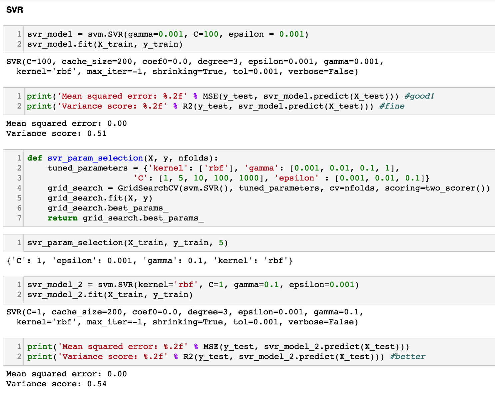

##### Random forest regression

The same process for Random Forest Regression, after tune, the R2 score can achieve 0.52. 

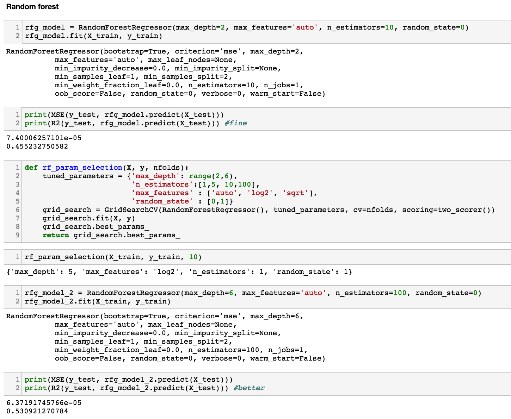

#####Neural network

And for neural network. I tried more than 10 combines, howevre this is already the best score I can get.

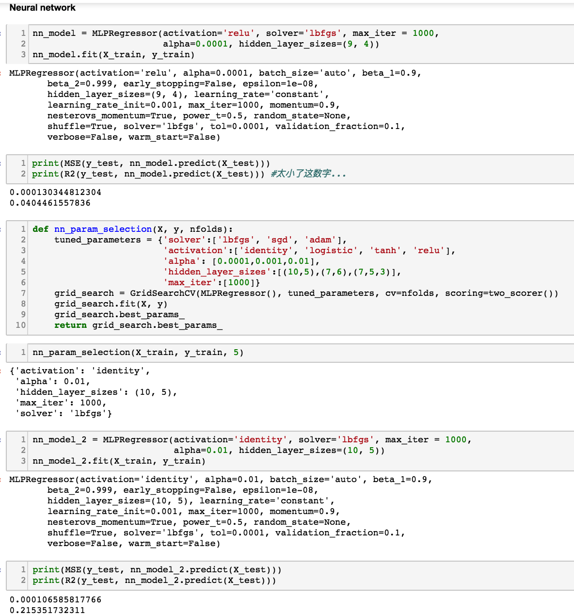

### Results

All four algorithms perform well if only taking MSE as loss function, however, if take R2 into consideration, then support vector regression has a much better performance.

### Reference

Kaggle: https://www.kaggle.com/

Wikipedia: https://www.wikipedia.org/

Stackoverflow: https://stackoverflow.com/

StackExchange: https://stackexchange.com/

